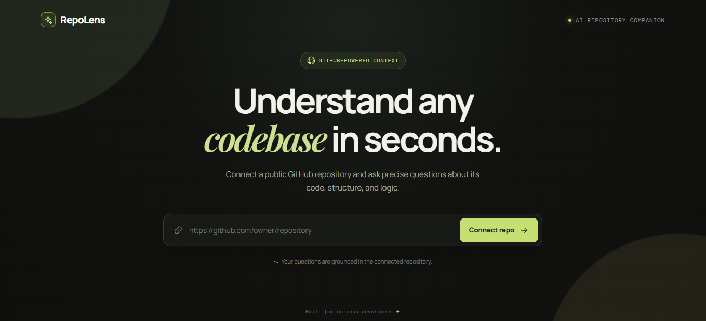
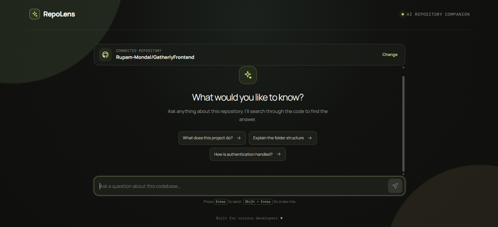
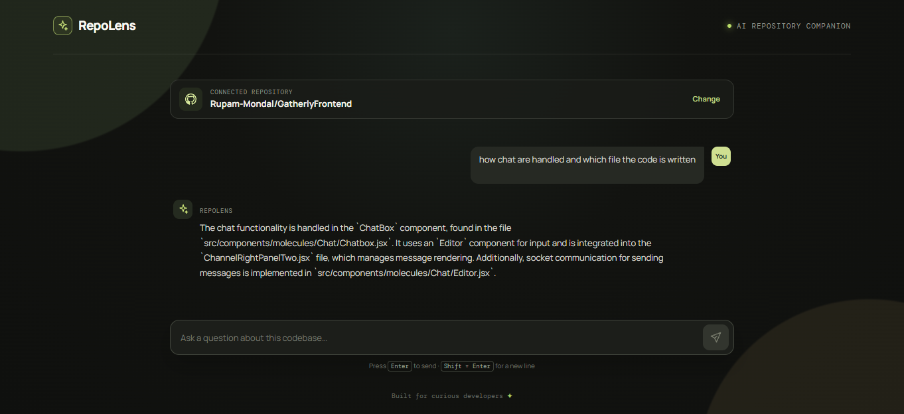

# Github_Smart_Assistant
Github Smart Assistant is an AI-powered GitHub Repository Assistant that lets you chat with any public GitHub repository. Simply provide a repository URL, and this app clones the project, indexes the codebase using Retrieval-Augmented Generation ```(RAG)```, stores embeddings in Qdrant, and answers questions grounded in the repository context.
---

## ✨ Features

-  Connect any public GitHub repository
-  Automatically clone the repository
-  Read and process supported source files
-  Intelligent document chunking using LangChain
-  Generate vector embeddings with OpenAI
-  Store embeddings in Qdrant Vector Database
-  Ask natural language questions about the repository
-  Repository-specific retrieval using unique `repoId`
-  Answers include relevant code context

---

## 📸 Demo

### Home Screen

<p align="center">
  
</p>

---

### Repository Connected

<p align="center">
  
</p>

---


### AI Answer

<p align="center">
  
</p>

## 🛠️ Tech Stack

### Frontend
- React

### Backend
- Node.js
- Express.js

### AI & RAG
- LangChain
- OpenAI Embeddings
- GPT-4o Mini
- Qdrant Vector Database
---

## 🏗️ Architecture

```text
GitHub Repository URL
          │
          ▼
 Clone Repository
          │
          ▼
 Read Repository Files
          │
          ▼
 Create LangChain Documents
          │
          ▼
 Split into Chunks
          │
          ▼
 Generate OpenAI Embeddings
          │
          ▼
 Store in Qdrant
          │
          ▼
 User Question
          │
          ▼
 Similarity Search
          │
          ▼
 Relevant Context
          │
          ▼
 GPT-4o Mini
          │
          ▼
 Final Answer
```

---
## ⚙️ Environment Variables
Backend
```env
QDRUNT_KEY='Your key'
QDRUNT_LINK='your link'
OPENAI_API_KEY='your api key'
```

frontend
```env
VITE_BACKEND_URL='your backend url'
```

## 📦 Installation

### Clone Repository

```bash
git clone https://github.com/Rupam-Mondal/Github_Repo_Assistant
```

### Install Frontend

```bash
cd client
npm install
```

### Install Backend

```bash
cd ../server
npm install
```

---

## ▶️ Run Project

### Backend

```bash
npm start
```

### Frontend

```bash
npm run dev
```

---